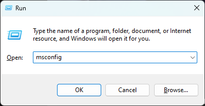
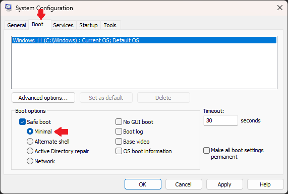

# Windows Defender Disabler

The script disables Windows Defender by modifying the "Start" entries in the Registry keys associated with Windows Defender services and adjusts the permissions of the Windows Defender Platform directory to facilitate its disabling.

## How to run the script?

First you need to boot into "Safe mode" on Windows using Win+R command and writting "msconfig" as show below.

Then go to "Boot" tab and check "Safe boot" option selecting "Minimal", after that click OK and reboot.

Finally run the powershell script with terminal, and thats all Windows Defender has been disabled successfully from your system.

> To reboot into "Normal mode" just do the same steps and uncheck "Safe mode" option, click OK and you are ready to go.